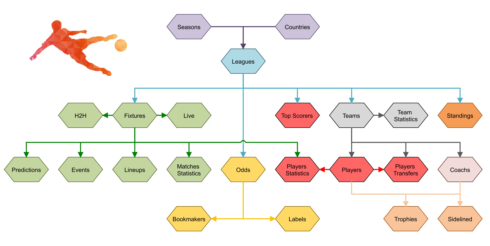

# 
 Live Score App Using Flutter

## Leagues Coverage

- [x] Division 1 :soccer:
- [x] Division 2 :soccer:
- [x] Division 3 :soccer:
- [x] Cup :trophy:
- [x] Super Cup :trophy:
- [x] Cyprus National Team :soccer:

## App Screenshots

<table style="width:100%">
  <tr>
    <th>Home Page</th>
    <th>Matches Today</th>
    <th>Lineups</th>
    <th>Standings</th>
    <th>Fixtures</th>
    <th>Teams</th>
    <th>Game Info</th>
    <th>Fixture</th>
    <th>Teams Players</th>
  </tr>
  <tr>
    <td>
       
    </td>
    <td>
       
    </td>
    <td>
       
    </td>
    <td>
       
    </td>
    <td>
      
    </td>    
    <td>
      
    </td>  
    <td>
      
    </td>  
    <td>
      
    </td>  
    <td>
      
    </td>  
  </tr>  
</table>

## API Data Provider

<strong>API Data Provider</strong>

| **Cyprus League**    | **Live**           | **Events**         | **Lineups**        | **Match Statistics** | **Players** | **Predictions**    | **Odds**           | **Player Statistics** | **Top Scorers**    | **Standings**      |
|----------------------|--------------------|--------------------|--------------------|----------------------|-------------|--------------------|--------------------|-----------------------|--------------------|--------------------|
| Division 1           | :white_check_mark: | :white_check_mark: | :white_check_mark: | :white_check_mark:   | :x:         | :white_check_mark: | :x:                | :white_check_mark:    | :white_check_mark: | :white_check_mark: |
| Division 2           | :white_check_mark: | :white_check_mark: | :white_check_mark: | :white_check_mark:   | :x:         | :white_check_mark: | :x:                | :white_check_mark:    | :white_check_mark: | :white_check_mark: |
| Division 3           | :x:                | :x:                | :x:                | :x:                  | :x:         | :white_check_mark: | :x:                | :white_check_mark:    | :white_check_mark: | :white_check_mark: |
| Cup                  | :white_check_mark: | :white_check_mark: | :white_check_mark: | :x:                  | :x:         | :white_check_mark: | :white_check_mark: | :x:                   | :x:                | :x:                |
| Super Cup            | :white_check_mark: | :white_check_mark: | :white_check_mark: | :x:                  | :x:         | :white_check_mark: | :x:                | :x:                   | :x:                | :x:                |
| Cyprus National Team | :white_check_mark: | :white_check_mark: |                    |                      | :x:         | :white_check_mark: |                    |                       |                    |                    |

<h3 align="left">Languages and Tools:</h3>

 

